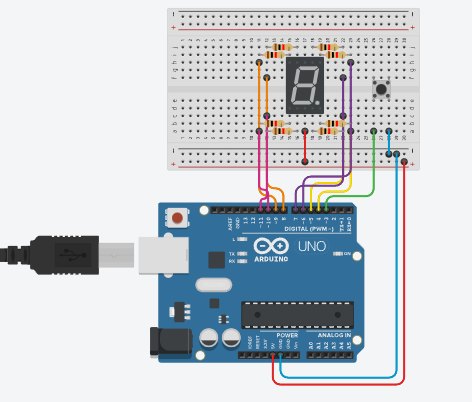
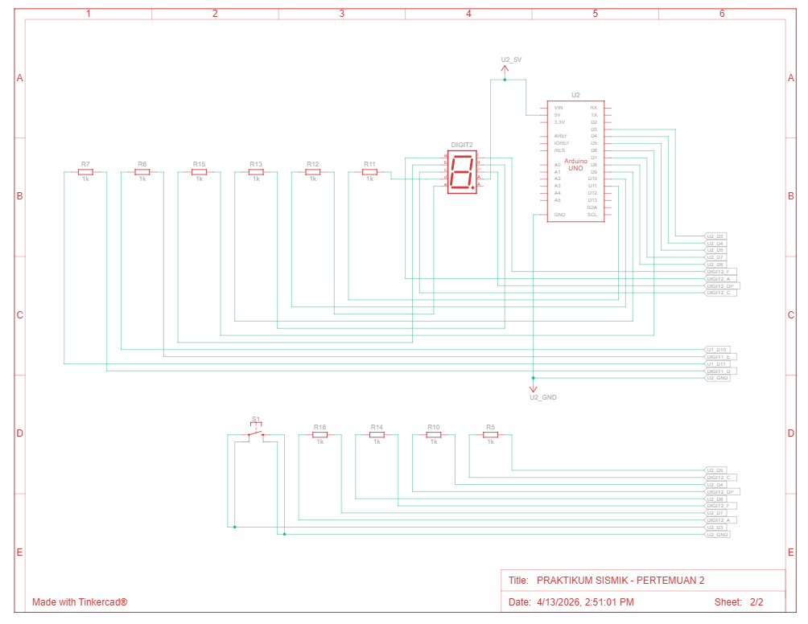

# Jawaban Pertanyaan Praktikum Modul 2: Pemrograman GPIO

**Nama:** Afif Nur Rahman  
**NIM:** H1H024016  
**Mata Kuliah:** TK244005-Praktikum Sistem Mikrokontroller

---

## Bagian 2.6.4: Percobaan 2A (Push Button)

### 1. Rangkaian Schematic yang Digunakan






### 2. Mengapa push button menggunakan mode `INPUT_PULLUP` pada Arduino Uno? Apa keuntungannya dibandingkan rangkaian biasa?
Mode `INPUT_PULLUP` digunakan untuk mengaktifkan resistor *pull-up* yang sudah terintegrasi (internal) di dalam mikrokontroler Arduino.
* **Keuntungannya:** Rangkaian terhindar dari kondisi *floating* (sinyal mengambang yang tidak menentu) saat tombol tidak ditekan, karena pin akan otomatis "ditarik" ke logika HIGH secara stabil. Hal ini membuat rangkaian *hardware* menjadi jauh lebih sederhana karena kita tidak perlu lagi repot memasang komponen resistor *pull-up* eksternal di atas *breadboard*.

### 3. Jika salah satu LED segmen tidak menyala, apa saja kemungkinan penyebabnya dari sisi hardware maupun software?
* **Sisi Hardware:** Kabel *jumper* ada yang putus atau longgar, pin kaki komponen tidak menancap sempurna di lubang *breadboard*, resistor penahan arus ada yang terbakar, atau salah satu batang LED dioda di dalam modul *seven segment* itu sendiri secara fisik sudah rusak/mati.
* **Sisi Software:** Terjadi kesalahan pemetaan (*mapping*) pada variabel array `segmentPins` (misal salah ketik urutan nomor pin), atau ada kesalahan logika bit `1` dan `0` pada array matriks `digitPattern` di baris/kolom segmen yang mati tersebut.

### 4. Modifikasi rangkaian dan program dengan dua push button (Increment & Decrement)
**Penjelasan Modifikasi:**
* **Hardware:** Menambahkan satu *push button* lagi. Satu kaki dihubungkan ke **Pin 2** Arduino (berfungsi sebagai tombol *Prev/Decrement*), dan kaki lainnya ke jalur **GND**.
* **Software:** Menambahkan inisialisasi tombol `btnPrev`, melacak status tombol sebelumnya, dan memberikan logika *if* untuk mendeteksi penekanan tombol decrement agar angka berkurang.


```cpp
#include <Arduino.h> // Memasukkan library standar Arduino

// 7-Segment Common Anode
// Pin mapping segment: a b c d e f g dp
const int segmentPins[8] = {7, 6, 5, 11, 10, 8, 9, 4}; // Deklarasi array untuk pin yang terhubung ke segmen a-dp

const int btnNext = 3; // Deklarasi pin 3 untuk tombol maju (Increment)
const int btnPrev = 2; // Deklarasi pin 2 untuk tombol mundur (Decrement) - Modifikasi

int currentDigit = 0;           // Variabel untuk menyimpan angka yang sedang ditampilkan saat ini
bool lastBtnNextState = HIGH;   // Variabel penyimpan status terakhir tombol Next (PULLUP = HIGH)
bool lastBtnPrevState = HIGH;   // Variabel penyimpan status terakhir tombol Prev (PULLUP = HIGH)

// Array 2D berisi pola bit untuk membentuk angka 0-9 dan huruf A-F
byte digitPattern[16][8] = {
  {1,1,1,1,1,1,0,0}, //0
  {0,1,1,0,0,0,0,0}, //1
  {1,1,0,1,1,0,1,0}, //2
  {1,1,1,1,0,0,1,0}, //3 
  {0,1,1,0,0,1,1,0}, //4
  {1,0,1,1,0,1,1,0}, //5
  {1,0,1,1,1,1,1,0}, //6
  {1,1,1,0,0,0,0,0}, //7
  {1,1,1,1,1,1,1,0}, //8
  {1,1,1,1,0,1,1,0}, //9
  {1,1,1,0,1,1,1,0}, //A
  {0,0,1,1,1,1,1,0}, //b
  {1,0,0,1,1,1,0,0}, //C
  {0,1,1,1,1,0,1,0}, //d
  {1,0,0,1,1,1,1,0}, //E
  {1,0,0,0,1,1,1,0}  //F
};

// Fungsi tampil digit (dibalik untuk CA)
void displayDigit(int num)
{
  for(int i = 0; i < 8; i++) // Perulangan sebanyak 8 kali untuk 8 pin segmen
  {
    // Menulis status digital ke pin, diberi negasi (!) karena Common Anode (LOW = Nyala)
    digitalWrite(segmentPins[i], !digitPattern[num][i]); 
  }
}

void setup()
{
  for(int i = 0; i < 8; i++) // Perulangan inisialisasi pin
  {
    pinMode(segmentPins[i], OUTPUT); // Mengatur semua pin segmen sebagai OUTPUT
  }

  pinMode(btnNext, INPUT_PULLUP); // Mengatur pin tombol Next sebagai INPUT dengan pull-up internal
  pinMode(btnPrev, INPUT_PULLUP); // Mengatur pin tombol Prev sebagai INPUT dengan pull-up internal

  displayDigit(currentDigit); // Menampilkan angka pertama (0) saat program baru dimulai
}

void loop()
{
  // Membaca status logika tombol saat ini
  bool btnNextState = digitalRead(btnNext); 
  bool btnPrevState = digitalRead(btnPrev);

  // deteksi tombol Next ditekan (Increment)
  // Syarat: tombol sebelumnya HIGH (tidak ditekan) dan sekarang LOW (ditekan)
  if(lastBtnNextState == HIGH && btnNextState == LOW) 
  {
    currentDigit++; // Menambah nilai digit sebanyak 1 angka
    if(currentDigit > 15) currentDigit = 0; // Jika nilai melebihi 15 (huruf F), kembalikan nilainya ke 0

    displayDigit(currentDigit); // Panggil fungsi untuk memperbarui tampilan layar
    delay(200); // debounce sederhana untuk mencegah pembacaan tombol ganda
  }

  // deteksi tombol Prev ditekan (Decrement)
  if(lastBtnPrevState == HIGH && btnPrevState == LOW)
  {
    currentDigit--; // Mengurangi nilai digit sebanyak 1 angka
    if(currentDigit < 0) currentDigit = 15; // Jika nilai kurang dari 0, melompat ke angka tertinggi yaitu 15 (F)

    displayDigit(currentDigit); // Panggil fungsi untuk memperbarui tampilan layar
    delay(200); // debounce sederhana untuk mencegah pembacaan tombol ganda
  }

  // Menyimpan status tombol saat ini untuk dijadikan perbandingan di siklus loop berikutnya
  lastBtnNextState = btnNextState;
  lastBtnPrevState = btnPrevState;
}
```
